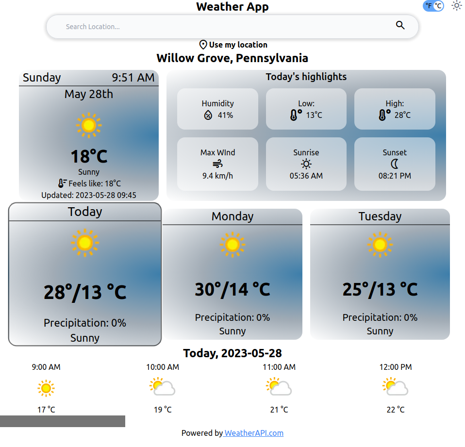

-   A simple weather website built in html, tailwind css, and vanilla JS, using WeatherAPI (www.weatherapi.com)
-   limited to 3 days, as per the free tier of the API
-   Users can click on the "use my location" to detect current location of the user

[Live Demo](https://razm123.github.io/Weather-App/)

